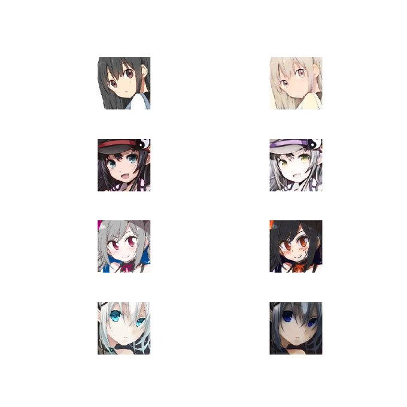
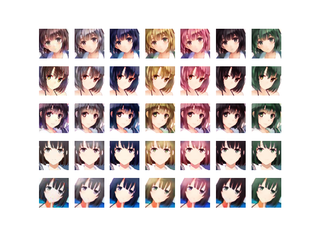

# ImageStyleTransfer

## Introduction
This repository implements style transfer methods by deep learning. You may be confused seeing repository's name and contents, it is natural because this repository mixes neural style transfer (ex. AdaIN) and image-to-image translation (ex. CycleGAN). I'm sorry. Anyway, from this point, I don't mention to neural style transfer. In image-to-image translation, I mainly implement the method of unpaired image-to-image translation. If I think of image-to-image translation on characters' images, it is interesting for me to convert hair color or hair style of character. However, if you do this in the system of paired image-to-image translation such as pix2pix, you'll find it difficult to collect paired data because there are few images of the same character in various hair colors. Therefore, I think it is better to implement unpaired image-to-image translation.

## Image-to-Image Translation Experiment

### Motivation
Described above, I intend to make use of unpaired image-to-image translation because I find difficulties with collecting paired data. I implement not only single domain to single domain translation such as CycleGAN, but also many domains to many domains translation such as StarGAN. Of course, I also implement multimodal translation such as MUNIT.

### Methods
There are many methods I tried in this repository. If you know details about each method, please visit each method's directory.

- [x] CycleGAN
- [x] StarGAN
- [x] InstaGAN
- [x] U-GAT-IT
- [x] RelGAN
- [ ] CartoonGAN
- [ ] DRIT
- [ ] MUNIT
- [ ] FUNIT
- [ ] SoftAdaIN

### Quick Results
- CycleGAN  

- StarGAN  

- InstaGAN  

- U-GAT-IT  

- RelGAN  

## Neural Style Transfer Experiment

### Motivation
In the system of image-to-image translation, we converts the part of image in source domain to this in target domain. However, I would like to convert the atmosphere of image to another such as real to anime. 

### Methods
There are many methods I tried in this repository. If you know details about each method, please visit each method's directory.

- [x] AdaIN
- [x] StyleAttentionNet
- [ ] SoftAdaIN

### Quick Results
- AdaIN  

- StyleAttentionNet  

